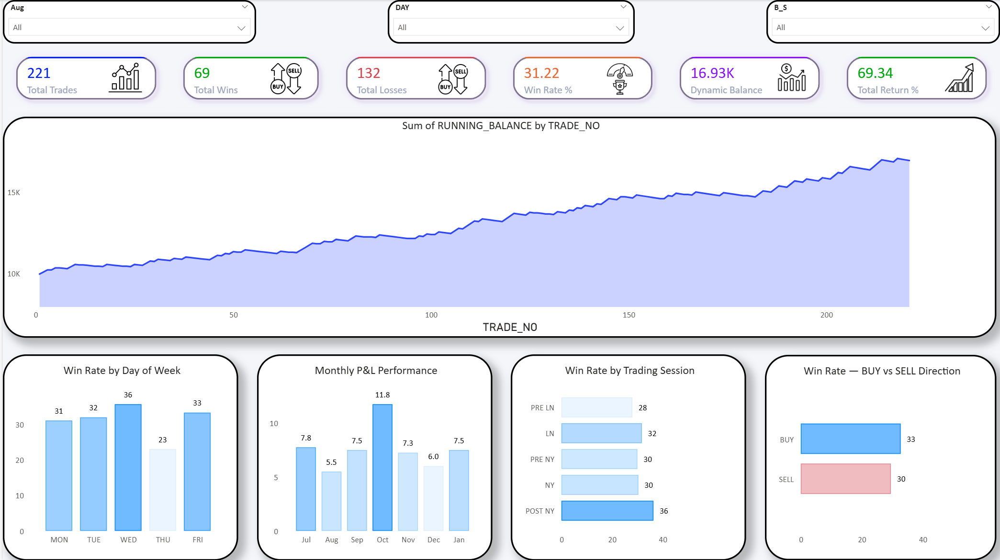
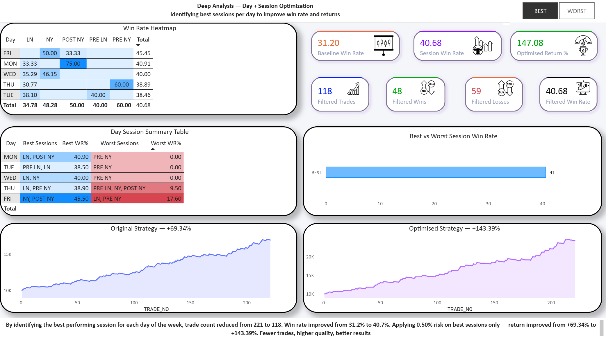

# EUR/USD Forex Strategy Backtest Analysis

## Project Overview
Analysis of 221 EUR/USD trades backtested over 7 months (Jul 2025 – Jan 2026).
The goal was to identify underperforming day and session combinations and 
optimise the strategy using data-driven filtering and position sizing.

**Tools used:** Python (pandas) · SQL (MySQL) · Power BI · Excel

---

## Problem Statement
A forex trader using an IFVG-based strategy on EUR/USD was taking 221 trades 
across all sessions and days. While the strategy was profitable (+69.34%), 
the question was: can we identify specific day+session combinations that 
are hurting performance — and improve results by trading only the best setups?

---

## Key Findings

### Finding 1 — Day level analysis is not enough
Thursday overall had the lowest win rate (23.1%). The obvious conclusion 
would be to avoid all Thursday trades. However data showed that removing 
all Thursday trades actually reduced return from +69.34% to +61.21%.

### Finding 2 — Day + Session combinations tell the real story
Drilling into Day + Session combinations revealed:

| Combination | Win Rate | Signal |
|---|---|---|
| THU + NY | 6.7% | AVOID |
| FRI + LN | 18.8% | AVOID |
| MON + PRE NY | 0.0% | AVOID |
| FRI + NY | 50.0% | BEST |
| MON + POST NY | 75.0% | BEST |
| WED + NY | 46.2% | BEST |

### Finding 3 — Best sessions identified per day

| Day | Best Sessions | Best Win Rate | Worst Sessions | Worst Win Rate |
|---|---|---|---|---|
| MON | LN, POST NY | 40.9% | PRE NY | 0.0% |
| TUE | PRE LN, LN | 38.5% | PRE NY | 0.0% |
| WED | LN, NY | 40.0% | PRE NY | 0.0% |
| THU | LN, PRE NY | 38.9% | PRE LN, NY, POST NY | 9.5% |
| FRI | NY, POST NY | 45.5% | LN, PRE NY | 17.6% |

### Finding 4 — Optimised strategy with position sizing

By trading only best sessions with 0.50% risk (vs flat 0.25%):

| Scenario | Trades | Win Rate | Return |
|---|---|---|---|
| Baseline | 221 | 31.2% | +69.34% |
| Best sessions only (0.25% risk) | 118 | 40.7% | +56.61% |
| Best sessions only (0.50% risk) | 118 | 40.7% | +143.39% |

**Result: Same strategy, fewer trades, double the return.**

---

## Project Structure
```
forex-strategy-analysis/
├── data/          → Raw backtest CSV (221 trades)
├── scripts/       → Python cleaning script + SQL queries
├── output/        → Enriched CSV with calculated columns
├── sql-results/   → Screenshots of all 8 SQL query results
└── dashboard/     → Power BI file + dashboard screenshots
```

---

## Dashboard Preview

### Page 1 — Strategy Overview


### Page 2 — Analysis and Optimisation


---

## How to Run

**Python:**
```bash
pip install pandas
cd scripts
python clean_enrich.py
```

**SQL:**
Import `output/eu_enriched.csv` into MySQL as table `trades`
Run queries from `scripts/forex_queries.sql`

**Power BI:**
Open `dashboard/forex_dashboard.pbix`
Data source → point to your local `output/eu_enriched.csv`

---

## Key Metrics
- **Pair:** EUR/USD
- **Timeframe:** 5 minute chart
- **Period:** July 2025 — January 2026
- **Strategy:** IFVG based entries
- **Risk:** 0.25% per trade (0.50% on best sessions)
- **Reward:** 1:5 Risk-Reward Ratio
- **Breakeven rule:** SL moved to BE when price reaches 3R

---

*Project by Shaikh Aaqib | Data Analyst Portfolio*

*LinkedIn: https://www.linkedin.com/in/aaqib-shaikh/ | Email: nizamishaikh5@gmail.com*
